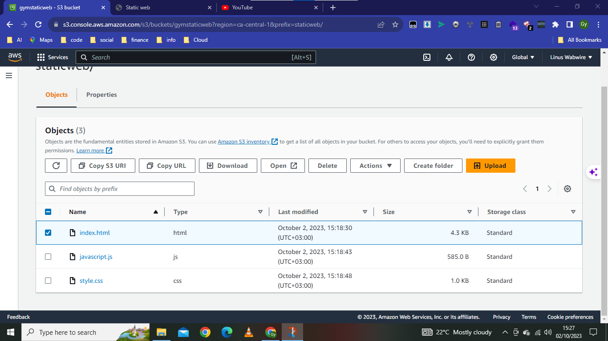
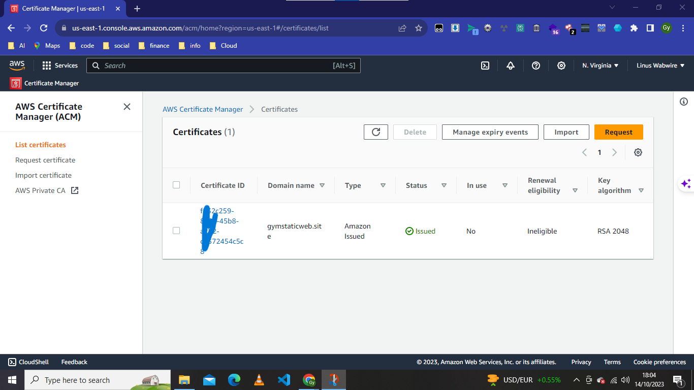
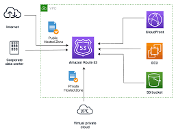

# CLOUD ENGINEERING & DEVOPS PROJECT 1

## Static Website Deployment with AWS Cloud Services


> View the live project: [Cloud Engineering Roadmap](https://github.com/Gymnott1/Cloud-engineering-roadmap/tree/main)

## Project Overview







This project demonstrates deploying a static website on AWS using a multi-service architecture that implements security best practices and modern cloud design patterns.

### Project Architecture

- **Frontend**: Static website hosted on Amazon S3
- **Security**: HTTPS implementation using Amazon CloudFront and Certificate Manager
- **DNS Management**: Amazon Route 53 for domain name resolution
- **Backend**: AWS Lambda (serverless functions) with Python/boto3
- **API Layer**: AWS API Gateway for RESTful endpoints
- **Database**: Amazon DynamoDB (NoSQL)
- **Authentication**: AWS IAM for security controls
- **Development**: AWS Amplify for building and hosting

### Implementation Strategy

This project uses a lift-and-shift strategy to move an existing application to cloud infrastructure while maintaining its core functionality and enhancing it with cloud-native features.

## Current Progress

The project is in progress with the following AWS services already implemented:

### 1. Amazon S3 Bucket

S3 is configured to host static content with proper access controls and bucket policies.


### 2. Route 53 DNS Configuration

DNS records have been configured to route traffic to the CloudFront distribution for secure content delivery.



### 3. CloudFront Distribution

Content delivery network is configured to serve the website with HTTPS enabled.


### 4. Certificate Manager

SSL/TLS certificate has been provisioned for secure HTTPS connections.


### 5. AWS Support Case

A support case was created to assist with specific configuration requirements.

### 6. Domain Registration & DNS Configuration

Domain purchased through Namecheap and DNS configuration completed.


## Website Frontend

The static website's frontend is built using:
- HTML5 for structure
- CSS3 for styling
- JavaScript for interactive elements

## Next Steps

The following components are planned for implementation:

1. **API Gateway Integration**
   - Create RESTful API endpoints to connect frontend to backend services

2. **Lambda Function Development**
   - Implement serverless functions using Python/boto3
   - Create handlers for API requests

3. **DynamoDB Implementation**
   - Design NoSQL database schema
   - Create tables for storing application data

4. **IAM Security Configuration**
   - Implement least privilege access controls
   - Configure roles and policies for Lambda functions

5. **Testing & Optimization**
   - Performance testing
   - Security vulnerability assessment
   - Cross-browser compatibility

## Technical Documentation

### Architecture Diagram

```
┌────────────┐     ┌────────────┐     ┌────────────┐
│  Route 53  │────▶│ CloudFront │────▶│    S3      │
└────────────┘     └──────┬─────┘     └────────────┘
                         │
                         ▼
┌────────────┐     ┌────────────┐     ┌────────────┐
│  API       │────▶│  Lambda    │────▶│ DynamoDB   │
│  Gateway   │     │  Functions │     │ Database   │
└────────────┘     └────────────┘     └────────────┘
```

### Implementation Details

#### S3 Bucket Configuration
- **Bucket Policy**: Public read access for website content
- **CORS Configuration**: Enabled for cross-origin requests
- **Static Website Hosting**: Enabled with index.html as root document

#### CloudFront Settings
- **Origin**: S3 bucket
- **Cache Behavior**: Optimized for static content
- **SSL Certificate**: Custom certificate from Certificate Manager
- **Security Policy**: TLSv1.2_2021

#### Route 53 Configuration
- **Record Type**: A record pointing to CloudFront distribution
- **TTL**: 300 seconds

## Resources

- [AWS Documentation](https://docs.aws.amazon.com/)
- [Cloud Engineering Roadmap](https://github.com/Gymnott1/Cloud-engineering-roadmap/tree/main)

## Project Status: In Progress

Last updated: April 24, 2025